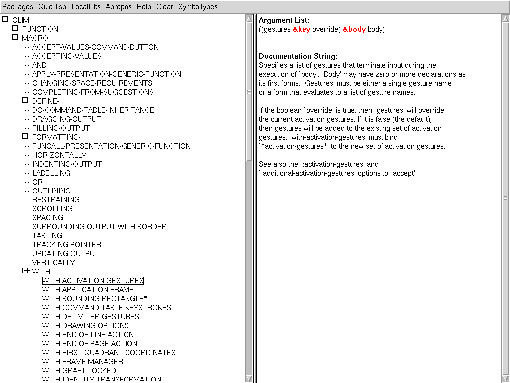

###### A simple package documentation, for now beeing more an example of a clim treeview application

(using ideas and some code from Peter Seibel's MANIFEST quicklisp package; see his licence/disclaimer in clim-pkg-doc.lisp)

Usage:

```
(clim-pkg-doc:pkg-doc)

(clim-pkg-doc:pkg-doc :cl-fad)


; new thread:

(clim-pkg-doc:pd)

(clim-pkg-doc:pd :cl-fad)

```


